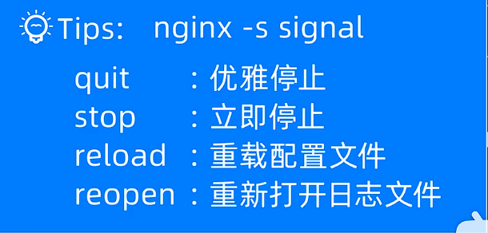
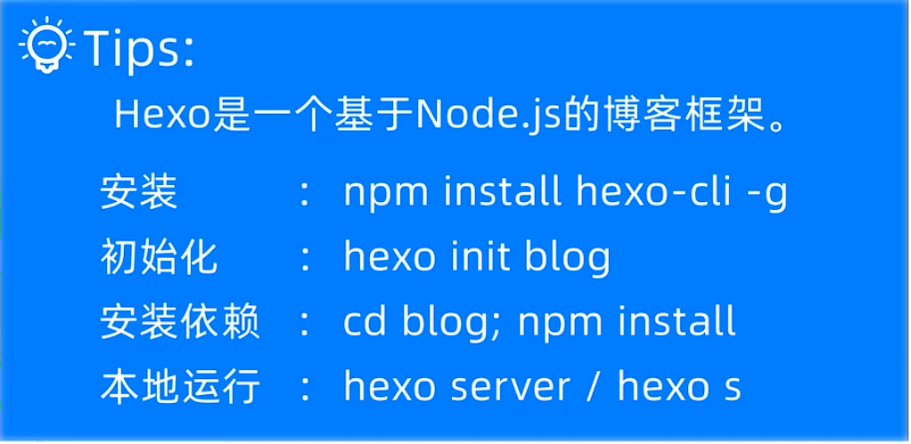

# 购买服务器后

1. 链接服务器

   finalshell

   ​	公网ip链接

2. 安装宝塔面板

   官网找linux面板， 代码安装

   安全组需要设置


# linux目录结构

win下scp命令传文件给服务器


用户crud

切换身份/用户


# linux环境配置

linux配置jdk环境变量：[Linux安装JDK并配置环境变量 - 详细步骤 - 知乎 (zhihu.com)](https://zhuanlan.zhihu.com/p/341775533)

linux配置mysql: 宝塔编译安装 + 宝塔已经配置了环境变量


阿里云linux服务器部署springboot项目:  [保姆级教程——将springboot项目部署到阿里云服务器（小白包会）_怎么把springboot项目部署到阿里云-CSDN博客](https://blog.csdn.net/Elon15/article/details/124516929)

- 安全组要设置端口

- ==mysql远程连接失效 10060== [【MySQL】使用 Navicat 远程访问数据库，提示 10060 Unknown Error_navicat远程连接数据库遇到的问题 10060 unknown error-CSDN博客](https://blog.csdn.net/qq_34416331/article/details/104198260)

  ```shell
  使用的端口是否正确
  netstat -ntpl
  
  2防火墙没有开放对应端口
  2.1查看是否有开放对应端口
  firewall-cmd --list-ports
  
  [root@iZbp13h6d6zievvsi6gehwZ ~]# firewall-cmd --list-ports;
  20/tcp 21/tcp 22/tcp 80/tcp 443/tcp 34960/tcp 39000-40000/tcp
  我就说昨天开了安全组,但是启动springboot项目,还是404 8080端口防火墙没开
  
  2.1若未开放，则开放对应端口
  firewall-cmd --zone=public --add-port=3306/tcp --permanent
  # zone 作用域
  # 3306/tcp  要开放端口
  # permanent 永久开放 若没有这个参数，则防火墙重启后失效
   
  # 重新加载生效
  firewall-cmd --reload
  
  2.2 再次查看开放没有
  
  开放了,但是not allow connect
  select host, user from user;
  update user set host = '%' where user = 'root';
  
  然后用宝塔重启以下mysql服务
  ```

- 优雅执行/关掉jar程序

  ```shell
  后台执行
  nohup java -jar  ***.jar  &     //***为你的jar包名
  nohup java -jar mes-admin-1.0.jar --server.port=8080 &
  
  关掉
  jps
  kill -15 pid
  ```


# nginx

正向代理：代理客户端  反向代理：代理服务端

负载均衡

动静分离！！！

# 

==安装==[Linux系统下安装配置nginx（保姆级教程）_linux 配置 nginx 1.25-CSDN博客](https://blog.csdn.net/qq_65732918/article/details/131862373)


```sh
Configuration summary
  + using system PCRE library
  + OpenSSL library is not used
  + using system zlib library

  nginx path prefix: "/usr/local/nginx"
  nginx binary file: "/usr/local/nginx/sbin/nginx"
  nginx modules path: "/usr/local/nginx/modules"
  nginx configuration prefix: "/usr/local/nginx/conf"
  nginx configuration file: "/usr/local/nginx/conf/nginx.conf"
  nginx pid file: "/usr/local/nginx/logs/nginx.pid"
  nginx error log file: "/usr/local/nginx/logs/error.log"
  nginx http access log file: "/usr/local/nginx/logs/access.log"
  nginx http client request body temporary files: "client_body_temp"
  nginx http proxy temporary files: "proxy_temp"
  nginx http fastcgi temporary files: "fastcgi_temp"
  nginx http uwsgi temporary files: "uwsgi_temp"
  nginx http scgi temporary files: "scgi_temp"

```


==配置环境变量-命令才方便跑==[centos下nginx配置及环境变量配置_不重启centos配置nginx环境变量-CSDN博客](https://blog.csdn.net/wuhenglan/article/details/103158665)

默认nginx文件路径: /usr/local/nginx/sbin

vim /etc/profile


服务启动



查看nginx所有文件路径: nginx -V

查看配置文件路径: nginx -t


前端项目部署到nginx

后端项目部署到tomcat

# 部署若以项目前后分离

安装用宝塔

linux配置redix环境变量:  [linux安装redis 并配置环境变量_linux配置redis环境变量-CSDN博客](https://blog.csdn.net/VariatioZbw/article/details/106868094)

[redis设置用户名和密码-CSDN博客](https://blog.csdn.net/weixin_38858749/article/details/124686796)

[redis连接问题Redis is running in protected mode because protected mode is enabled, no bind address was s-CSDN博客](https://blog.csdn.net/qq_43470725/article/details/123097233)

[【redis】redis:ERR AUTH ＜password＞ called without any password configured for the default user解决办法_err auth  called without any password co-CSDN博客](https://blog.csdn.net/qq_36977923/article/details/121962045)

[高效解决 springBoot 集成 Redis 出现的: Unable to connect to Redis 问题_io.lettuce.core.redisconnectionexception: connecti-CSDN博客](https://blog.csdn.net/wandongshengno_1/article/details/102749689)

```
设置用户名密码
requirepass hsp

保护模式关掉
protected-mode no 


注释下面这一行
bind 127.0.0.1
```


```
查看有没有在启动
ps aux | grep redis

关闭redis
redis-cli
auth hsp
shutdown

启动redis
cd /www/server/redis/src
redis-server ../redis.conf &
```

linux安装unzip： yum install -y unzip zip

```text
unzip zipped_file.zip
```

windows安装npm： [windows安装npm教程_npm 安装-CSDN博客](https://blog.csdn.net/zhouyan8603/article/details/109039732)


admin里面有主程序

ruoyi-ui是前端项目&打包&部署到nginx

[vue-cli-service不是内部或外部命令,也不是可运行的程序-CSDN博客](https://blog.csdn.net/weixin_43170297/article/details/107039529)

[nodejs新版本引起的：digital envelope routines::unsupported-CSDN博客](https://blog.csdn.net/fengyuyeguirenenen/article/details/128319228)

```
在ruoyi-ui目录下 npm install 去安装这个前端项目的依赖
set NODE_OPTIONS=--openssl-legacy-provider
npm run build:prod
```


项目本地配置：

1. druid.yml改数据库配置 url, username, password

2. 在yml改redis: 地址和密码

3. 改日志文件: 保存路径, 每个encoder里面写charset配UTF-8

4. 把后端项目发送到云服务器（jdk，mysql，redis，tomcat）

当前我的配置：

两台服务器的redis用杭州服务器，密码hsp；mysql用的是杭州服务器，密码hsp

杭州放后端项目

深圳服务器（也能跑后端项目）的mysql没有若以的数据库，前端项目放nginx


# hexo安装

[Linux 安装 node，npm （详细图解）_linux 安装node npm-CSDN博客](https://blog.csdn.net/u011262253/article/details/104903255)



halo: 个人博客系统
hugo
hexo: markdown => 纯静态页面,每次部署


```
hexo init
hexo s
hexo n

hexo clean
hexo g

npm install --save hexo-deployer-git

hexo d
```


[IDE工具(43) idea使用Deployment部署项目到服务器的全过程_idea remote deployment-CSDN博客](https://blog.csdn.net/qq_38225558/article/details/94736404)

[使用IDEA中的SSH连接远程Linux系统服务器_idea ssh-CSDN博客](https://blog.csdn.net/cnds123321/article/details/121945088)

