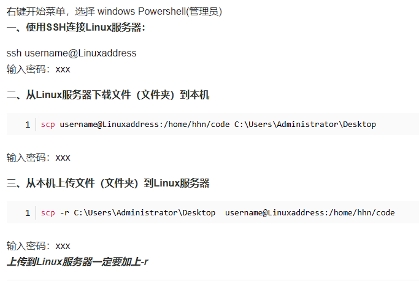

购买服务器后

1. 链接服务器

   finalshell

   ​	公网ip链接

2. 安装宝塔面板

   官网找linux面板， 代码安装

   安全组需要设置

linux目录结构

win下scp命令传文件给服务器

用户crud

切换身份/用户

linux配置jdk：[Linux安装JDK并配置环境变量 - 详细步骤 - 知乎 (zhihu.com)](https://zhuanlan.zhihu.com/p/341775533)

linux配置mysql：[linux上mysql的安装与配置，超全_linux mysql配置文件-CSDN博客](https://blog.csdn.net/qq_45363033/article/details/107011716)

