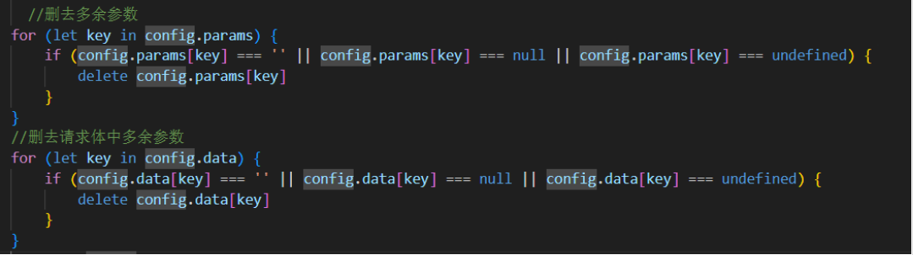

- [ ] jmeter
- [x] jwt
- [x] session与cookie
- [x] nginx
- [ ] [后端掌握Vue知识_vue后端-CSDN博客](https://blog.csdn.net/m0_49183244/article/details/121088087?utm_medium=distribute.pc_relevant.none-task-blog-2~default~baidujs_baidulandingword~default-8-121088087-blog-112475154.235^v39^pc_relevant_3m_sort_dl_base3&spm=1001.2101.3001.4242.5&utm_relevant_index=11)

- [ ] redis (mybatis 性能要求不大也可以代替redis)

- [ ] spring security
- [ ] 


spring boot 自动装配


# 做题遇到的坑

mybatis分页查询

动态sql

[Mybatis mapper层 同时传入实体类和单独的参数_mybatis map和实体类同时 传参-CSDN博客](https://blog.csdn.net/qq_35387940/article/details/104775583)

jackson使用[Jackson使用详解 - 掘金 (juejin.cn)](https://juejin.cn/post/6844904166809157639)

- 在AuthenticationEntryPoint中，把java对象返回Result格式字符串

mybatis提示两个小错误：解决方法：

- 给每个Service加@Transactional
- yml配置mybatis的mapper-locations: classpath*:/com/carbon/mapper/*.xml

mybatiis模糊查询 "%"#{value}"%"  或者 concat("%",#{ },"%")

mybatis sql 判断大小 [Mybatis中的大于、小于、大于等于、小于等于、不等于的两种写法_mybatis 不等于-CSDN博客](https://blog.csdn.net/yuanmuchunpin/article/details/127487788?utm_medium=distribute.pc_relevant.none-task-blog-2~default~baidujs_baidulandingword~default-0-127487788-blog-110483385.235^v40^pc_relevant_anti_vip&spm=1001.2101.3001.4242.1&utm_relevant_index=3)

[IDEA 配置启动多个相同SringBoot服务_idea允许启动多个bootserver-CSDN博客](https://blog.csdn.net/qq_31519989/article/details/112254157)

[Java文件下载，提供前端页面下载、HttpClient接口下载_java服务器有文件,提供给前端下载文件接口-CSDN博客](https://blog.csdn.net/shenju2011/article/details/109547739)

==trim:== [MyBatis动态SQL（认真看看， 以后写SQL就爽多了） - 知乎 (zhihu.com)](https://zhuanlan.zhihu.com/p/165092050)

[vue axios传参时如果为空或null，不传该字段_post 请求字段为null时参数不传-CSDN博客](https://blog.csdn.net/yf18040578780/article/details/126365732?utm_medium=distribute.pc_relevant.none-task-blog-2~default~baidujs_baidulandingword~default-0-126365732-blog-115033039.235^v40^pc_relevant_anti_vip&spm=1001.2101.3001.4242.1&utm_relevant_index=3)



前端日期参数格式化和传递

- [ElementPlus-ui 时间日期选择器输出格式调整为年月日(YYYY-MM-DD）_前端日期选择器怎么设置成yyyy-mm-dd-CSDN博客](https://blog.csdn.net/weixin_57997644/article/details/131864287)

日期参数

```
日期组件新搞一个ref对象
把params多写两个key,
再发请求之前,把绑定到的值,给params的key
```

下拉菜单

mybatis分页 多写pageno pagesize total(多写一个简单的sql count(主键))

pojo写分页和日期参数时，记住只有数据库字段名用构造器（有且只有一个有参构造器）， jackson接收参数用的属性不需要构造器，使用setget方法完成的

[Navicat配置mysql数据库用户权限_数据库用navicat给用户添加对表的权限-CSDN博客](https://blog.csdn.net/qq_21187515/article/details/92618885)

[【Mybatis】功能强大的动态SQL之foreach批量查询、批量插入_mybatis foreach查询-CSDN博客](https://blog.csdn.net/Bcoder_m/article/details/119571146)

